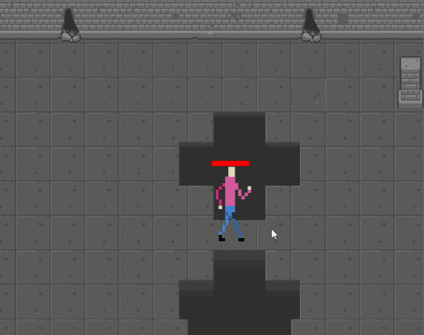

# jzgame
### a 2D game engine built on top of [SDL2](https://www.libsdl.org/)

___
Based on an Entity Component design:
- game objects are Entities
- entites have an arbitrary number of Components
- Components are updated each tick
- The Components that two Entities have determines the interactions between them  
  
Included components and systems imlpement various features such as:  

- sprite drawing/animation
- tilemap drawing
- entity movement
- collision detection
- menu UI including debug settings  
  
  
- projectiles
- input handling
- pathfinding, and more  
  
  
